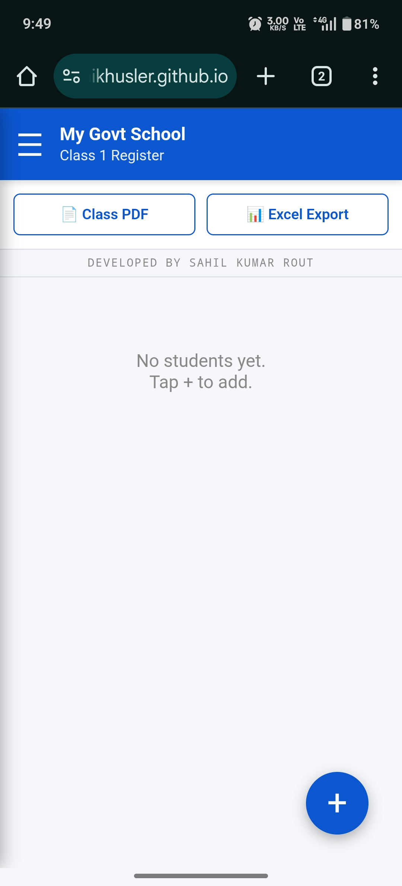
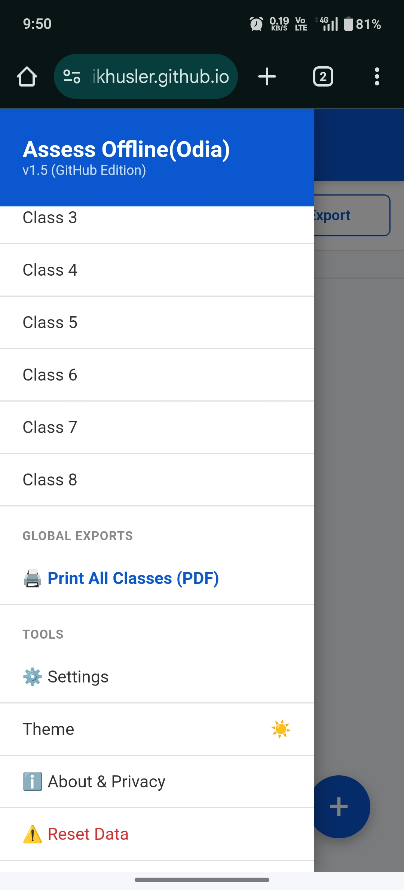
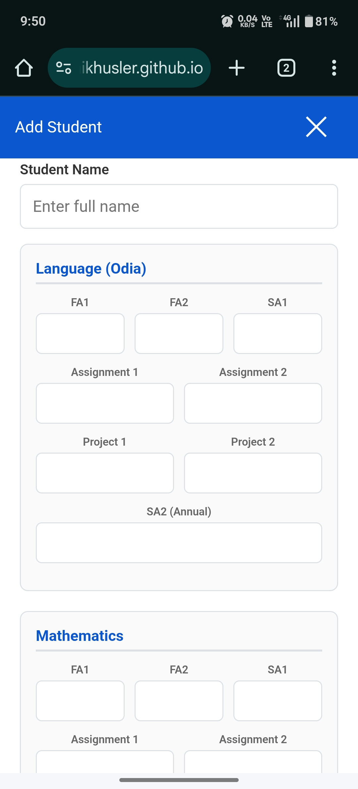

# 🏫 Assess Offline (Odia) - v2.0 (Github Edition)

**Assess Offline** is a secure, 100% offline Mark Register application designed specifically for Government Schools in Odisha. 

This **v2.0 (Github Edition)** is the "Gold Master" release, featuring a dynamic weightage engine that makes it future-proof for NEP 2020 curriculum changes. It generates professional, official-grade PDF reports with Odia translations.

---

## 🚀 Key Features

### 🛡️ 100% Offline & Secure
* **No Internet Required:** Works completely without data.
* **Privacy First:** All data is stored locally on your device (LocalStorage). No data is ever sent to a cloud server.
* **Backup & Restore:** Easily save your school data to a file (`.json`) and restore it on any device.

### 🧮 Dynamic Weightage Engine (New!)
* **Flexible Logic:** Unlike old apps with hardcoded math, v2.0 allows you to configure **Full Marks** and **Weightage %** in Settings.
* **NEP 2020 Ready:** If the Govt changes Project marks from 10 to 20 next year, you just update the Settings. No coding required.
* **Rounding Policy:** Uses `Math.ceil()` (Successor Rounding) to benefit students (e.g., 23.1 becomes 24).

### 📄 Professional Reporting (Print Ready)
* **Vertical Merge Layout:** The Grand Total and Percentage columns span vertically across all subjects for a clear, readable summary.
* **Official Styling:** Headers (School Name, UDISE) use **Times New Roman (Bold, Black)** to look like official registers.
* **Odia Translations:**
    * Assignment → **ଲିଖିତ କାର୍ଯ୍ୟ**
    * Project → **ପ୍ରକଳ୍ପ କାର୍ଯ୍ୟ**
    * Grand Total → **ସର୍ବମୋଟ ପ୍ରାପ୍ତାଙ୍କ**

### 📱 Optimized User Experience
* **AMOLED Dark Mode:** Pure Black (`#000000`) interface for battery saving and high contrast.
* **Smart Save:** Warns you if marks are missing/empty before saving (prevents "Ghost Completion").
* **Input Guards:** Prevents typing marks higher than the exam limit (e.g., typing 26 in a 25-mark exam).

---

## 📖 User Manual

### 1. Getting Started
1.  Open the app.
2.  Go to **Menu (☰)** → Enter **School Name**, **UDISE Code**, and **Session**.
3.  These details will automatically appear on all PDF prints.

### 2. Adding a Student
1.  Select a Class from the Menu.
2.  Tap the **(+)** button.
3.  Enter the Student's Name (Auto-converts to CAPITAL letters).
4.  Enter marks. **Note:** If a student is absent, enter `0`. Do not leave it blank.

### 3. Printing Registers (PDF)
1.  Click **"📄 Class PDF"** for a single class or **"🖨️ Print All Classes"** for the whole school.
2.  The system generates an A4 Landscape PDF.
3.  **Layout:** The Grand Total is displayed in a merged column on the far right.

### 4. Backup & Restore (Important!)
* **To Backup:** Open Menu → Click **💾 Backup Data**. Save the file to your phone/Google Drive.
* **To Restore:** Open Menu → Click **📂 Restore Data** → Select your backup file.
* *Tip:* Do this weekly to ensure your data is safe.

---

## ⚙️ Configuration (Settings)

Go to **Menu > Settings** to customize the exam logic.

| Setting | Default (Primary) | Description |
| :--- | :--- | :--- |
| **Pass Mark %** | 30 | Minimum percentage required to pass. |
| **FA Max Marks** | 25 | Maximum marks for Formative Assessments. |
| **SA Max Marks** | 50 | Maximum marks for Summative Assessments. |
| **Written Full Mark** | 10 | The max mark the exam is out of. |
| **Written Weightage** | 10 | The marks it contributes to the final score. |
| **Project Full Mark** | 10 | The max mark the exam is out of. |
| **Project Weightage** | 20 | The marks it contributes to the final score. |

---

## 📸 App Screenshots

---

## 👨‍💻 Developer Info

* **Developer:** Sahil Kumar Rout
* **Version:** v2.0 (Github Edition)
* **License:** MIT (Free & Open Source)

**Disclaimer:** This software is provided "as is". The developer is not responsible for data loss caused by clearing browser cache or uninstalling the browser. Please use the "Backup" feature regularly.
