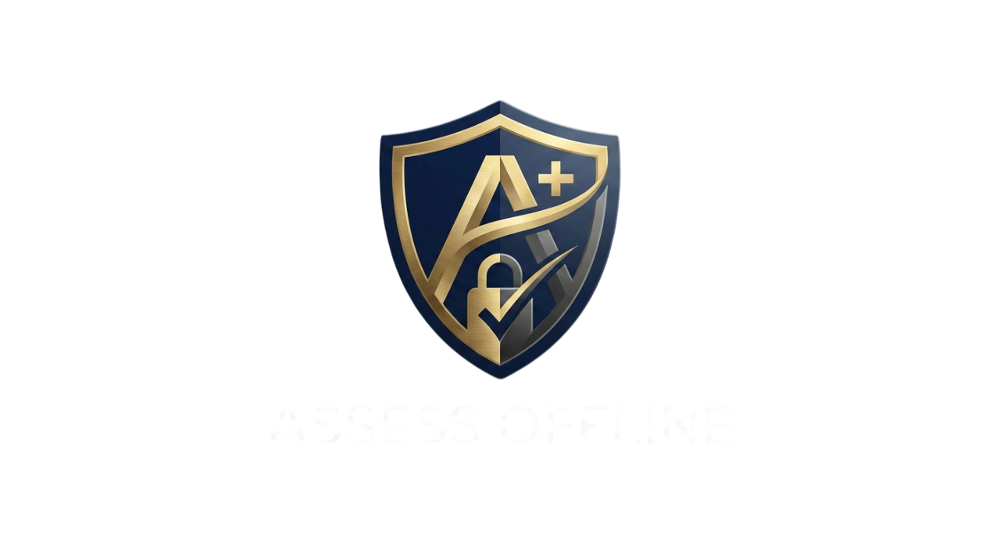
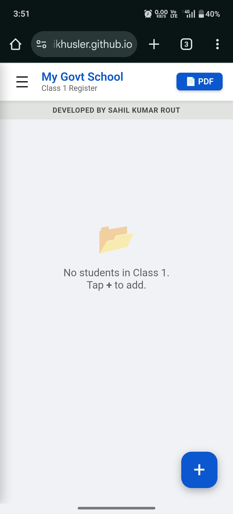
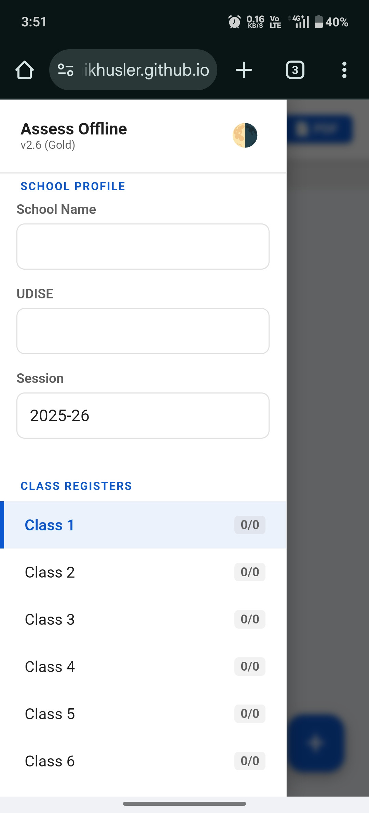
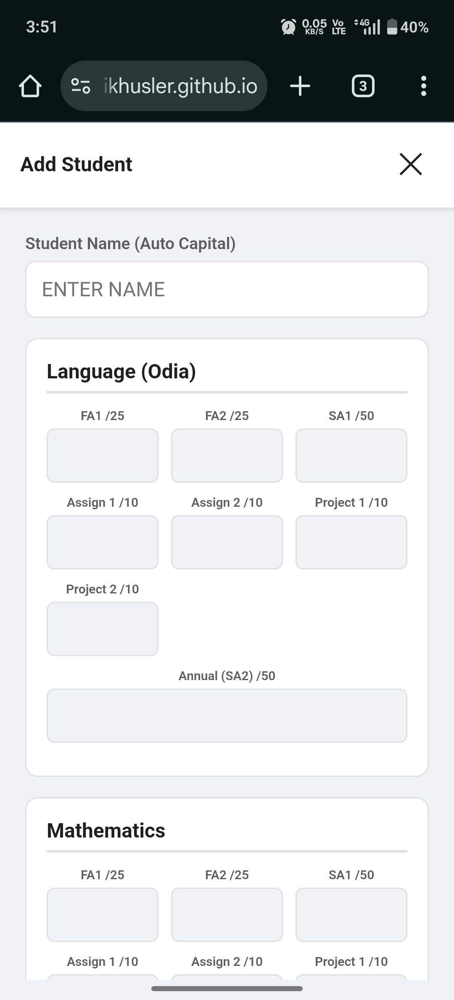
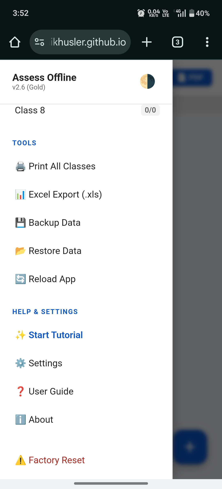
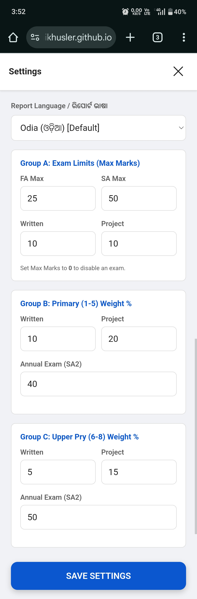
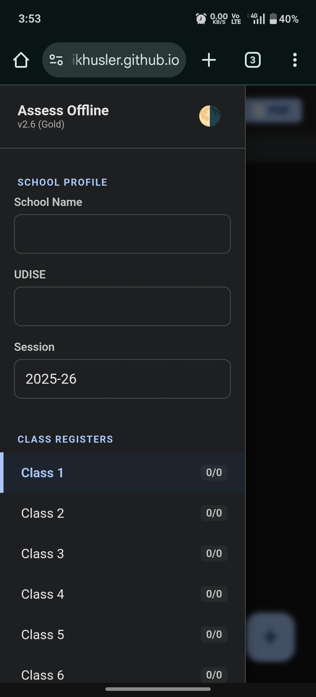

  
    

  # 🎓 Assess Offline v4.1
  ### The Ultimate Offline-First Student Assessment Tool

  

    
    
    
    
  

   

  > **"Zero Server. Zero Lag. 100% Privacy."** 
  > *Empowering teachers with professional-grade tools that run anywhere.*

---

## ⚡ What is Assess Offline?

**Assess Offline** is a high-performance, single-file web application engineered for teachers to manage marks, calculate complex weightages, and generate reports without an internet connection. 

Built with a **"Monolithic Architecture"**, the entire app lives inside one `index.html` file. It uses advanced `localStorage` techniques to ensure your data never leaves your device.

---

## 💎 Premium Features

### 🎨 **OLED-Ready UI**
Featuring a stunning **"Google Blue"** & **"Deep OLED Black"** theme. The interface uses a "Filled Input" design language for maximum readability and reduced eye strain during late-night grading.

### 🧩 **"Tetris" Grid System**
A smart, responsive marking grid that adapts to mobile screens.
- **Auto-Layout:** Fits 3 subjects per row on standard phones.
- **Space-Saving:** The **SA-2** box automatically spans 2 columns to fill empty gaps, reducing vertical scrolling by **20%**.

### 🛡️ **Iron-Clad Security**
- **Self-Healing Storage:** Automatically detects data corruption and resets safely without crashing ("White Screen of Death" protection).
- **XSS Protection:** Built-in sanitization strips malicious HTML tags from student names.
- **Safe Restore:** Pre-flight validation ensures backup files are healthy before loading.

---

## 🚀 Quick Start

1.  **Download:** Get the latest `index.html` from the **[Releases](#)** page.
2.  **Run:** Open the file in **Chrome**, **Edge**, or **Android System WebView**.
3.  **Configure:** Tap `☰ Menu` > `School Profile` to set your school details.
4.  **Start:** Click `+ Add Student` and begin entering marks.

---

## ⚙️ Engineering & Configuration

### **Calculation Engine**
The app uses a transparent, human-readable grading logic that favors the student:
- **Rounding:** All fractional marks are rounded **UP** using `Math.ceil()`.
- **Weightage:** Fully customizable via `Settings` > `Group B`.
  - *Default:* T1 (30%), Written (10%), Project (20%), Annual (40%).

### **Smart Export**
- **Dynamic Naming:** PDFs are automatically saved as:
  `Class [X] [Session] Mark Register [UDISE].pdf`
- **Excel Support:** Exports `.xls` files with **UTF-8 BOM** encoding to correctly display **Odia (ଓଡ଼ିଆ)** and other regional languages.

---

## 🛠️ Technical Highlights

For developers and auditors reviewing the source:

* **Sanity Loops:** The `restoreData()` function runs a pre-flight check to ensure all Class Arrays (`1-8`) exist before committing data to memory.
* **Defensive DOM:** Helper functions like `setVal` wrap DOM interactions in `try...catch` blocks to prevent crashes on older WebViews.
* **Scalability:** The codebase uses `const MAX_CLS = 8`, making it trivial to upgrade the app to support Class 9 or 10 in a single line change.

---

## 📜 Changelog

### **v4.1 (Final Stable) - *The Golden Master***
> *Released: Feb 2026*
* **✨ UI:** Implemented "Tetris Grid" logic—`SA-2` box now spans 2 columns.
* **🛡️ Security:** Added `sanitize()` function to prevent XSS attacks.
* **🐛 Fix:** `restoreData` now runs a "Sanity Loop" before saving, preventing crashes.
* **💅 Polish:** Reduced input padding for a high-density, professional look.

### **v4.0**
* **🔧 Feature:** Restored "Weightage %" editing in Settings (Group B).
* **⚖️ Legal:** Added Non-Govt Disclaimer & MIT License.
* **📄 Export:** Added Smart PDF Filename generation (e.g., `All class (2025-26)...`).

### **v3.2**
* **💾 Core:** Fixed Android File Picker (`MIME type */*`) issue.
* **🌐 Encoding:** Added `\uFEFF` BOM for Excel compatibility.

---

## ⚠️ Disclaimer

  

    This software is an independent open-source project developed by <strong>Sahil Kumar Rout</strong>. 
    It is <strong>NOT</strong> an official Government application and is <strong>NOT</strong> funded, endorsed, or affiliated with any Government entity.
  

---

## 📱 Screenshots

  
  
  
  
  
    
  
  

---

## 🚀 How to Use

### 1. Installation
No installation required! This is a web application.
* **Live Link:** [Click Here to Open App](https://atomikhusler.github.io/ASSESS-OFFLINE-ODIA-/) 

### 2. Setup Profile
* Tap the **Menu (☰)** button.
* Enter your **School Name**, **UDISE Code**, and **Session**.

### 3. Add Students
* Select a **Class** from the menu.
* Tap the **(+)** button to add a student.
* Enter marks. **Note:** If a student is absent, enter `0`. If an exam (like Written) was not held, set its Max Mark to `0` in Settings.

### 4. Generate Reports
* **Single Class:** Click the **[ 📄 PDF ]** button in the header.
* **Whole School:** Go to **Menu > Tools > Print All Classes**.

---

## ⚙️ Configuration (Advanced)
You can customize the exam rules in **Settings**:

* **Group A (Limits):** Set the Full Marks for Question Papers (e.g., FA=25, SA=50).
* **Group B (Primary 1-5):** Define weightage % for written/project (Default: 10%/20%).
* **Group C (Upper Pry 6-8):** Define weightage % for written/project (Default: 5%/15%).

> **Tip:** To disable an exam (e.g., No Project), set the Max Mark to `0`. The app will automatically exclude it from calculations.

---

## 🔒 Privacy Policy
**Your Data is Yours.**
* This application runs entirely in your browser (Client-Side).
* **No data** is sent to any external server or cloud.
* **Warning:** Clearing your browser cache/history will delete your data.
* **Backup:** Use the **"Backup Data"** option in the menu weekly to save a copy to your device.

---

  <b>© 2026 Sahil Kumar Rout</b> 
  <i>Licensed under MIT License</i>

## 👨‍💻 Developer Info

* **Developer:** Sahil Kumar Rout
* **Version:** v2.0 (Github Edition)
* **License:** MIT (Free & Open Source)

**Disclaimer:** This software is provided "as is". The developer is not responsible for data loss caused by clearing browser cache or uninstalling the browser. Please use the "Backup" feature regularly.

---

## 📬 Contact
Found a bug? Have a feature request?
* **Telegram:** [@Assess_Offline](https://t.me/+pV0H_iNurNAyMmZl)
*

---

## 🤝 Support & License

  **Found a bug?** Open an [Issue](../../issues) or contact the developer. 
  
  
  
  Built with ❤️ for Teachers in Odisha

---

## 💖 Donate
If this app helps you manage your school registers easily, please consider supporting the development effort.

**UPI (India):**  

