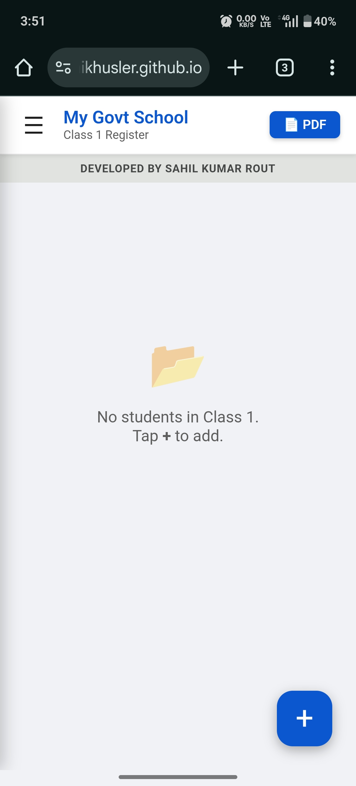
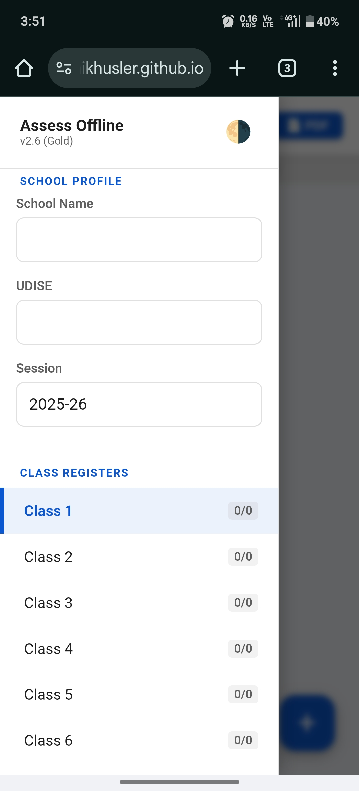
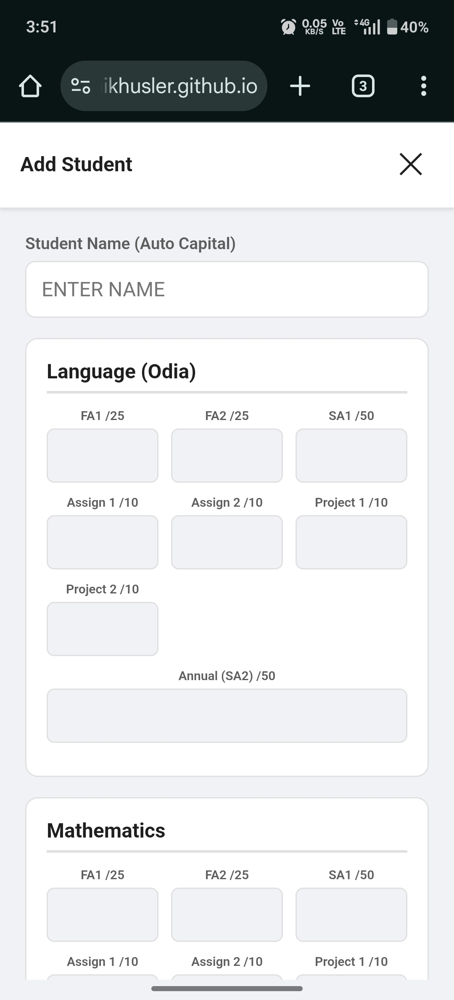
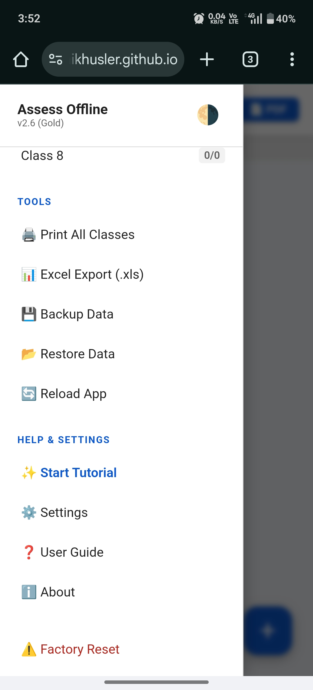
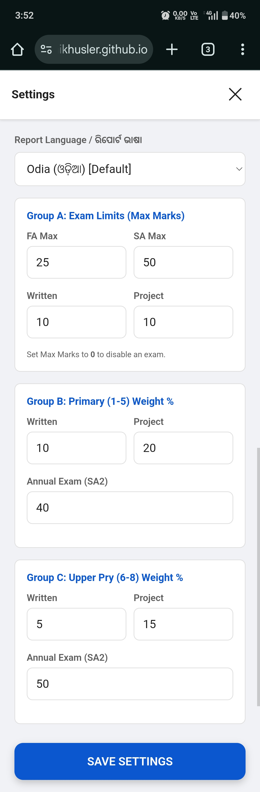
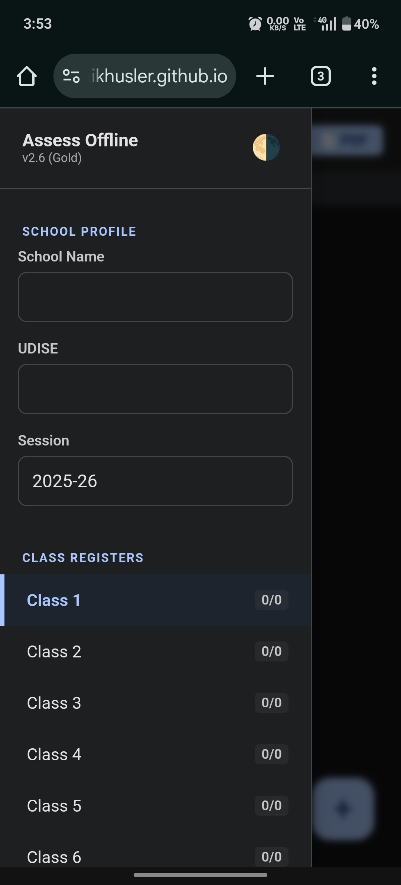

  
    

  # 🎓 Assess Offline: Digital CCE Register
  ### The Ultimate Offline-First Student Assessment Tool

  

    
    
    
    
  

   

  > **"Zero Server. Zero Lag. 100% Privacy."** 
  > *Empowering teachers with professional-grade tools that run anywhere.*

---

## ⚡ What is Assess Offline?

**Assess Offline** is a high-performance, single-file web application engineered for teachers to manage marks, calculate complex weightages, and generate reports without an internet connection. 

Built with a **"Monolithic Architecture"**, the entire app lives inside one `index.html` file. It uses advanced `localStorage` techniques to ensure your data never leaves your device.
**Assess Offline** solves the connectivity problem in remote classrooms. It runs 100% in your browser without requiring a backend, a database, or an internet connection after the initial load. Zero cost, zero logins, and absolute data privacy.

---

## 💎 Premium Features

### 🎨 **OLED-Ready UI**
Featuring a stunning **"Google Blue"** & **"Deep OLED Black"** theme. The interface uses a "Filled Input" design language for maximum readability and reduced eye strain during late-night grading.

### 🧩 **"Tetris" Grid System**
A smart, responsive marking grid that adapts to mobile screens.
- **Auto-Layout:** Fits 3 subjects per row on standard phones.
- **Space-Saving:** The **SA-2** box automatically spans 2 columns to fill empty gaps, reducing vertical scrolling by **20%**.

### 🛡️ **Iron-Clad Security**
- **Self-Healing Storage:** Automatically detects data corruption and resets safely without crashing ("White Screen of Death" protection).
- **XSS Protection:** Built-in sanitization strips malicious HTML tags from student names.
- **Safe Restore:** Pre-flight validation ensures backup files are healthy before loading.

---

## 🔗 Quick Links
* 🚀 **[Open the Web App][https://atomikhusler.github.io/ASSESS-OFFLINE/]**

  
* 📺 **[Watch the Video Tutorial][https://youtu.be/xhutzDh2UqY?si=Ew4jg-2NVq7XkCqE]**

  
* 👥 **[Join the Telegram Support Group](https://t.me/+pV0H_iNurNAyMmZl)**

  
* 📢 **[Follow the Telegram Channel](https://t.me/assess_offline_channel)**

---

## ✨ Core Features
* 🛡️ **100% Offline-First:** All student data is persisted locally using standard browser `localStorage`. No data ever leaves your device.
* 💎 **Glass Morphism UI:** A stunning, optically modern interface featuring frosted glass panels, abstract gradients, and smooth hardware-accelerated transitions.
* 🖨️ **Print & Export Engine:** Generate massive A4 Landscape PDF reports and legacy-friendly Microsoft Excel (`.xls`) spreadsheets instantly.
* 🌍 **Regional Keyboard Support:** Built-in parsers intercept and convert regional commas (`,`) to decimal dots (`.`) for seamless data entry on all global mobile keyboards.
* 🇮🇳 **Bilingual Support:** Full UI support for both English and Odia (ଓଡ଼ିଆ).

---

## 🚀 Quick Start

1.  **Download:** Get the latest `index.html` from the Link:[https://atomikhusler.github.io/ASSESS-OFFLINE/]
2.  **Run:** Open the file in **Chrome**, **Edge**, or **Android System WebView**.
3.  **Configure:** Tap `☰ Menu` > `School Profile` to set your school details.
4.  **Start:** Click `+ Add Student` and begin entering marks.

---

## ⚙️ Engineering & Configuration

### **Calculation Engine**
The app uses a transparent, human-readable grading logic that favors the student:
- **Rounding:** All fractional marks are rounded **UP** using `Math.ceil()`.
- **Weightage:** Fully customizable via `Settings` > `Group B`.
  - *Default:* T1 (30%), Written (10%), Project (20%), Annual (40%).

### **Smart Export**
- **Dynamic Naming:** PDFs are automatically saved as:
  `Class [X] [Session] Mark Register [UDISE].pdf`
- **Excel Support:** Exports `.xls` files with **UTF-8 BOM** encoding to correctly display **Odia (ଓଡ଼ିଆ)** and other regional languages.

---

## 🛠️ Technical Highlights

For developers and auditors reviewing the source:

* **Sanity Loops:** The `restoreData()` function runs a pre-flight check to ensure all Class Arrays (`1-8`) exist before committing data to memory.
* **Defensive DOM:** Helper functions like `setVal` wrap DOM interactions in `try...catch` blocks to prevent crashes on older WebViews.
* **Scalability:** The codebase uses `const MAX_CLS = 8`, making it trivial to upgrade the app to support Class 9 or 10 in a single line change.

---
# 📜 Changelog

## [v6.0] — Elite Edition (2026-03-19)

### 🚀 Core Engine Upgrades
* **Government-Compliant Math**: Integrated a strict **Ceiling Engine** (`Math.ceil`) to ensure all weightage percentages round up to the next whole number per official guidelines.
* **Numeral-Only Sanitization**: Locked input fields to digits `0-9` only, instantly stripping decimals and non-numeric characters for cleaner data entry.
* **Subject-Wise Evaluation**: Re-engineered the result logic to provide **Per-Subject Pass/Fail** status based on the $\ge 30\%$ threshold.

### 📄 Document Architecture (PDF & Excel)
* **3-Tier Super Headers**: Implemented a dynamic "Internal Assessment" umbrella header that perfectly groups Term 1, Written, and Project work.
* **Surgical Column Removal**: Optimized the register layout by permanently deleting legacy weightage and grand total columns (L, P, T, U).
* **A4 Print Optimization**: 
    * Bumped base font size to **10pt** for physical readability.
    * Matched vertical and horizontal header sizes for visual symmetry.
    * Forced **Bold Black Ink** for Pass/Fail results to ensure high-contrast printing.
* **Bulk Export Logic**: Patched the class selection array to properly iterate through ALL classes `1` through `8` during multi-sheet Excel generation.

### 🛠️ Stability & Security
* **Spooler Protection**: Eliminated the print race condition by using `requestAnimationFrame` to verify the DOM has painted before opening the system spooler.
* **Excel Grid Alignment**: Added 2 metadata rows at the top of spreadsheets and adjusted header-style offsets for flawless MS Office and WPS compatibility.

---

# 📜 Changelog
## [v5.0] - 2026-03-13
### 🚀 Major Architectural Upgrades
* **Decoupled Print Engine:** Transitioned from a single-file system to a high-performance **Two-File Architecture** (`index.html` + `print.html`) to bypass mobile browser security restrictions.
* **Pure-Payload Delivery:** Developed a "Bridge" system that transfers raw data from the main app to a dedicated print tab via `localStorage`, ensuring 100% data integrity without server dependencies.
* **Static Snapshot Downloader:** The "Download HTML" feature now generates a pure, script-free HTML file, preventing "No Data Found" errors when opened from local device storage.
* **Named-Tab Navigation:** Implemented a synchronous tab-reusage strategy to prevent local server freezes and bypass aggressive mobile pop-up blockers.

### 💎 User Interface & Experience (UX)
* **Glassmorphic Info System:** 
* **Scroll-Lock Synchronization:** 
* **Safety Exit (X-Close):**

### 🖨️ Printing & Export Optimizations
* **Rigid Table Architecture:** Implemented `table-layout: fixed` and explicit mathematical column widths to solve the "Chopped Column" bug on Android print spoolers.
* **Repeated Header Logic:** Engineered CSS `table-header-group` rules to ensure school headings and subject labels repeat automatically on every page of a multi-page printed report.
* **1-Second Rapid Spooling:** Optimized the font-loading delay from 3 seconds to 1 second for a faster, more responsive export workflow.
* **PC-Optimized Excel:** Refined the `.xlsx` engine to include hardcoded landscape formatting and signature blocks for perfect "One-Click" printing on computers.

### 🛠️ Bug Fixes
* **Resolved:** Fixed the "Loading..." hang on mobile browsers by switching to a synchronous named-tab navigation strategy.
* **Corrected:** Fixed a critical string concatenation error (`${payload}`) that caused the HTML downloader to fail in certain mobile environments.
* **Cleaned:** Removed duplicate script execution in the print engine that caused potential browser crashes on low-RAM devices.
* **Optimized:** Fixed viewport scaling issues that caused headers and signatures to misalign on mobile screens.

## [v4.6] - 2026-02-17
### **Rebranding & Identity**
* **New Official Name**: Rebranded to **Assess Offline: Digital CCE Register** to align with government educational standards.
* **School-Compliant PDF Headers**: Integrated the formal Odia title **"ନିରନ୍ତର ଓ ବ୍ୟାପକ ଆକଳନ ଫର୍ଦ୍ଦ"** (Continuous & Comprehensive Assessment Sheet) for official school records.
* **Dynamic Title Engine**: Updated the translation object (`TR`) to automatically switch report titles between English and Odia based on user settings.

### **Architectural Upgrades**
* **Split Limits Tiering**: Introduced independent Max Mark configurations for **Primary (Class 1-5)** and **Upper Primary (Class 6-8)**.

* **Safe Schema Hydration**: Implemented intelligent database booting in `init()` to silently patch old save files with new Upper Primary limit keys without risking user data loss.
  
* **Legacy Data Clamping**: Modified the math engine and PDF generator to use strict `Math.min()` clamping, ensuring that legacy marks from v4.5 do not exceed new v4.6 limits in grand total calculations.

### **PDF & Print Engine Fixes**
* **Bottom-to-Top Headers**: Re-engineered vertical table headers to read from bottom-to-top using a 180-degree rotation, matching traditional physical registers.
  
* **Layout Stability**: Fixed the CSS for vertical text (`.v-txt`) by removing absolute positioning to prevent table cell collapse during browser-side PDF generation.
  
* **NaN Protection**: Added division-by-zero safeguards (`maxT1 > 0 ? ... : 0`) to prevent "NaN" errors in grand totals for non-exam classes.
  
* **Absentee Rendering**: Updated the `pM` (Safe Render) function to correctly display the "-" (Absent) flag on printed reports.

### **UI/UX & Mobile Optimization**
* **Compact Label Hack**: Applied a `-0.5px` letter-spacing constraint to UI labels, allowing full text for **"Assignment 1"** and **"Project 1"** without causing "..." truncation on narrow mobile screens.
* **Drawer Animation Lock**: Resolved a race condition in `toggleDrawer()` using a global `clearTimeout` variable, preventing background interaction while the menu is transitioning.
* **Touch-Tap Protection**: Disabled native OS text selection on the developer pill via CSS (`user-select: none`) to prevent accidental Google Search popups during rapid log tapping.
* **Validation Hardening**: Strengthened `checkComp` logic to detect and block malformed data (such as standalone decimal points) that previously caused silent math failures.

### **Data Management**
* **Anchor Sorting for Backups**: Prepended the `!` symbol to JSON backup filenames to ensure they always appear at the absolute top of the user's download list regardless of sort order.
* **Log System Rebranding**: Updated internal black-box logging to reflect the new **Digital CCE Register** identity for easier troubleshooting.

### 🚀 Changelog: v4.5 (The "Fortress" Update)
*This update brings an elite-level architectural overhaul, resolving deep mobile OS bottlenecks and securing the UI physics.*

### 🛠️ Elite Engineering & Mobile Bypasses
* **Android Back-Button Trap:** Implemented a custom `window.history.pushState` router. Pressing the physical back button now safely closes active modals instead of killing the browser tab.
* **XSS Layout Armor:** Deep string sanitization injected into all UI rendering loops and PDF/Excel export engines. Malicious input strings can no longer shatter the table layouts.
* **Native OS Routing Security:** Bypassed aggressive Android/iOS anti-malware pop-up blockers by migrating the "Restore Data" trigger to a native HTML `<label>` node.
* **iOS Safari Scroll Lock:** Added native `ontouchmove="event.preventDefault()"` to overlay backgrounds to stop iPhones from "rubber-banding" behind Glass modals.

### ⚡ UX & Input Speed Hacks
* **The "Double-Dot" Speed Hack:** Tapping `..` on a mobile numeric keypad instantly transforms into a `-` (Absent). The math engine safely parses this as a 0, preventing `NaN` calculation crashes.
* **Singleton Notification Engine:** Re-architected notifications into a strict Singleton DOM node to prevent invisible ghost elements from stacking in the DOM.
* **Smart Auto-Focus:** Opening the "Add Student" modal instantly triggers the hardware keyboard and focuses the cursor, eliminating repetitive screen tapping.

### 📊 Structural Math Upgrades
* **Class 8 Autonomy:** Class 8 has been surgically separated into an independent database tier to accommodate its unique subject count.
* **Elective Merge:** Hindi and Sanskrit are now elegantly merged into a single `"Hindi / Sanskrit"` column, permanently resolving validation errors for the 3rd language elective.
* **Smart Migration Engine:** The boot sequence automatically detects missing Class 8 databases in older save files and safely clones existing customizations instead of overwriting them with defaults.
  
### **v4.1 (Final Stable) - *The Golden Master***
> *Released: Feb 2026*
* **✨ UI:** Implemented "Tetris Grid" logic—`SA-2` box now spans 2 columns.
* **🛡️ Security:** Added `sanitize()` function to prevent XSS attacks.
* **🐛 Fix:** `restoreData` now runs a "Sanity Loop" before saving, preventing crashes.
* **💅 Polish:** Reduced input padding for a high-density, professional look.

### **v4.0**
* **🔧 Feature:** Restored "Weightage %" editing in Settings (Group B).
* **⚖️ Legal:** Added Non-Govt Disclaimer & MIT License.
* **📄 Export:** Added Smart PDF Filename generation (e.g., `All class (2025-26)...`).

### **v3.2**
* **💾 Core:** Fixed Android File Picker (`MIME type */*`) issue.
* **🌐 Encoding:** Added `\uFEFF` BOM for Excel compatibility.

---

## ⚠️ Disclaimer

  

    This software is an independent open-source project developed by <strong>Sahil Kumar Rout</strong>. 
    It is <strong>NOT</strong> an official Government application and is <strong>NOT</strong> funded, endorsed, or affiliated with any Government entity.
  

---

## 📱 Screenshots

  
  
  
  
  
    
  
  

---

## 🚀 How to Use

### 1. Installation
No installation required! This is a web application.
* **Live Link:** [Click Here to Open App](https://atomikhusler.github.io/ASSESS-OFFLINE-ODIA-/) 

### 2. Setup Profile
* Tap the **Menu (☰)** button.
* Enter your **School Name**, **UDISE Code**, and **Session**.

### 3. Add Students
* Select a **Class** from the menu.
* Tap the **(+)** button to add a student.
* Enter marks. **Note:** If a student is absent, enter `0`. If an exam (like Written) was not held, set its Max Mark to `0` in Settings.

### 4. Generate Reports
* **Single Class:** Click the **[ 📄 PDF ]** button in the header.
* **Whole School:** Go to **Menu > Tools > Print All Classes**.

---

## ⚙️ Configuration (Advanced)
You can customize the exam rules in **Settings**:

* **Group A (Limits):** Set the Full Marks for Question Papers (e.g., FA=25, SA=50).
* **Group B (Primary 1-5):** Define weightage % for written/project (Default: 10%/20%).
* **Group C (Upper Pry 6-8):** Define weightage % for written/project (Default: 5%/15%).

> **Tip:** To disable an exam (e.g., No Project), set the Max Mark to `0`. The app will automatically exclude it from calculations.

---

## 🔒 Privacy Policy
**Your Data is Yours.**
* This application runs entirely in your browser (Client-Side).
* **No data** is sent to any external server or cloud.
* **Warning:** Clearing your browser cache/history will delete your data.
* **Backup:** Use the **"Backup Data"** option in the menu weekly to save a copy to your device.

---

  <b>© 2026 Sahil Kumar Rout</b> 
  <i>Licensed under MIT License</i>

## 👨‍💻 Developer Info

* **Developer:** Sahil Kumar Rout
* **Version:** v2.0 (Github Edition)
* **License:** MIT (Free & Open Source)

**Disclaimer:** This software is provided "as is". The developer is not responsible for data loss caused by clearing browser cache or uninstalling the browser. Please use the "Backup" feature regularly.

---

## 📬 Contact
Found a bug? Have a feature request?
* **Telegram:** [@Assess_Offline](https://t.me/+pV0H_iNurNAyMmZl)
*

---

## 🤝 Support & License

  **Found a bug?** Open an [Issue](../../issues) or contact the developer. 
  
  
  
  Built with ❤️ for Teachers in Odisha

---

## 💖 Donate
If this app helps you manage your school registers easily, please consider supporting the development effort.

**UPI (India):**  

